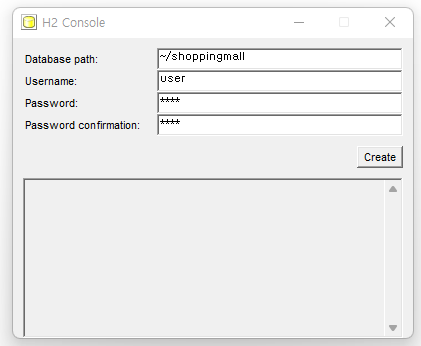

# ShoppingMall Server

## 프로젝트 환경 : IntelliJ IDE, Spring Boot, JAVA 8 이상, MAVEN, H2 DB   

### 1. 소스 다운 및 Import 

      1-1. Github 소스를 다운 받거나 Github Repository Clone

      1-2. https://www.h2database.com/html/main.html 에서 OS 환경에 맞는 H2 DB 설치 파일 다운로드 후 설치

### 2. 개발 환경 설정 

      2-1. 내장 톰캣 타깃 사용으로 ShoppingMallApplication.java를 찾아 설정

      2-2. OS가 Window 일 경우 우측하단 숨기기 아이콘 클릭 > H2 Database Engine 아이콘 우클릭 > Ceate new database... 클릭

      2-3. 다른 OS 일 경우 https://so-easy-coding.tistory.com/5 블로그 참조

      2-4. db 정보 

           - Database path: ~/shoppingmall

           - Username: user

           - Password: 1234

           - Password confirmation: 1234
           
            주의 : DB 정보 설정 변경 시 에 application.yml 파일도 같이 수정 필요

      2-4. db schema, data는 resource 폴더 안에 schema.sql, data.sql 안에 넣었고 서버 기동 시 로드 
### 참조) 

